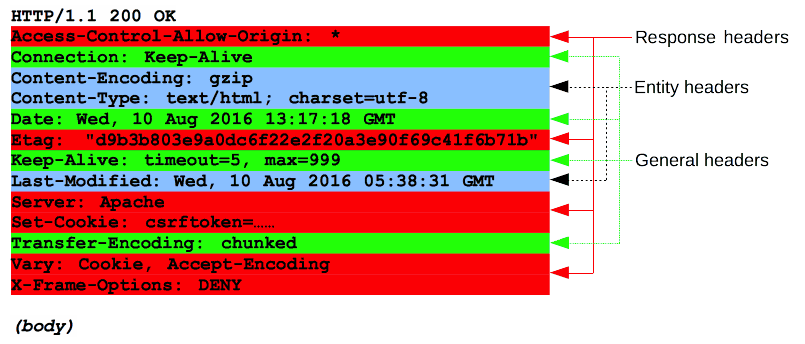
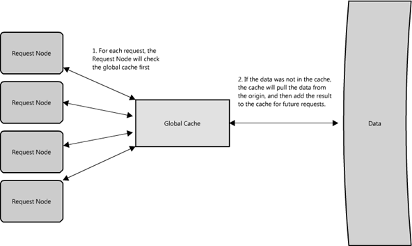
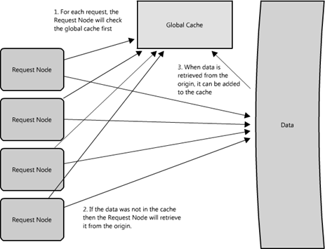

# 질문과 답변

## 1.1 HTTP: 인터넷의 멀티미디어 배달부

### Q. 프로토콜이란? \(명근\)

프로토콜을 직역하면 `규약`이다.

일반적으로 프로토콜이라 함은, 통신 프로토콜을 칭하는데 통신\(정보를 주고 받음\)할 때 객체 간의 `규칙, 양식, 규약` 등을 사전에 정의해놓은 것을 말한다.

> 하드웨어, 소프트웨어, ... 등 모든 것을 총칭하여 객체라고 칭하였습니다.

통신 프로토콜들은 \[OSI 7 계층에 곳곳에\]\([https://en.wikipedia.org/wiki/List_of\_network\_protocols\_\(OSI\_model](https://en.wikipedia.org/wiki/List_of_network_protocols_%28OSI_model)\)\) 자리하고 있다.

우리가 자주 보게 되는 프로토콜은 주로 \[Application Level의 프로토콜\]\([https://en.wikipedia.org/wiki/List_of\_network\_protocols\_\(OSI_model\)\#Layer\_7\_\(Application\_Layer\)\)일](https://en.wikipedia.org/wiki/List_of_network_protocols_%28OSI_model%29#Layer_7_%28Application_Layer%29%29일) 것이다.

Web Client가 URI를 요청할 때 붙는 Scheme`(HTTP, HTTPS, ...)`들이 대표적인 예이다.

결론적으로 두 객체 간의 협의만 이루어 진다면 그 협의 내용이 프로토콜이 되는 것.

이러한 협의 내용은 공식 표준으로 제정된 내용도 있고 `아닌 내용`\([Custom Protocol](https://stackoverflow.com/questions/3964152/how-do-i-create-a-custom-protocol-and-map-it-to-an-application)\)도 있다.

> `Line://`, `Spotify://` 같은 프로토콜도 존재한다.

만약 Client가 Server에게 HTTP Request를 날렸을 때, 표준을 지켜 날린다고 해도 Server가 표준을 지키지 않는다면 기대하는 내용의 Response 를 받을 수 없을 것이다.

### Q. HTTP는 무엇의 약자인가? 그 의미는 무엇인가? \(우빈\)

HTTP는 하이퍼텍스트 전송 규약\(HyperText Transfer Protocol\)의 약자이다. 하이퍼텍스트\(hypertext\)란 참조\(하이퍼링크, hyperlink\)를 통해 한 문서에서 다른 문서로 즉시 접근할 수 있는 텍스트를 말한다. \(위키백과\) [http://www.google.com과](http://www.google.com과) 같이, 웹 페이지 주소의 시작 부분에 '\[\[[http://'\(또는\]\(http://'%28또는\]\(http://'%28또는\]%28http://'%28또는\)\](http://'%28또는]%28http://'%28또는]%28http://'%28또는]%28http://'%28또는%29\)\) '\[\[[https://'\)를\]\(https://'%29를\]\(https://'%29를\]%28https://'%29를\)\](https://'%29를]%28https://'%29를]%28https://'%29를]%28https://'%29를%29\)\) 명시함으로써 하이퍼텍스트 문서 교환을 http로 처리할 수 있다.

전통적인 텍스트는 한 텍스트를 읽기 위한 한 가지 선형적 순서가 전제되어 있다. 예를 들어 독자가 한 권의 책을 읽을 때 첫 페이지, 다음 페이지, ..., 마지막 페이지의 순서로 책을 읽을 것이라고 예상할 수 있다. 반면 하이퍼텍스트를 읽는 순서는 결정되어 있지 않은데, 노드\(node\)라고 불리는 페이지 단위 사이에 서로 다른 노드를 연결하는 링크\(link\)라는 연결점이 존재하기 때문이다.

HTTP는 클라이언트-서버 프로토콜이다. 사용자 에이전트\(예: 웹 브라우저\)는 하나의 개체\(예: HTML 문서\)에 대한 요청을 보낸다. 서버는 개 요청을 처리하고 응답\(response\)을 보내게 된다.

### Q. http는 80, https는 443을 기본 포트로 사용한다. URI Scheme과 Port의 상관관계는 무엇일까? \(명근\)

[https://gist.github.com/mahmoud/2fe281a8daaff26cfe9c15d2c5bf5c8b](https://gist.github.com/mahmoud/2fe281a8daaff26cfe9c15d2c5bf5c8b)

사실 http 스키마을 사용하면서 8080 포트를 사용할 수도 있다.

결국 기본 포트를 뭐로 하느냐는 생략 가능한 포트 번호를 표기하는 것일 뿐 큰 차이는 없지 않을까...?

모르겠다..

### Q. UDP 위에서는 동작할 수 없나요? reliable 한 전송계층 프로토콜 이라면 어떤 프로토콜이든 관계 없나요? \(자훈\)

신뢰성 있는 전송계층 프로토콜에서만 동작하며, 그것만 보장되면 어떤 프로콜이든 사용될 수 있음.

최근 TCP의 한계를 극복하기 위해 UDP 에 신뢰성을 더한 프로토콜들이 등장하고 여러 분야에서 실험적으로 사용되고 있음. \(QUIC, DTLS ...\)

* head of line blocking
* 프로토콜 확장성 문제
* hand shake overhead
* ...

[https://www.ietf.org/rfc/rfc2616.txt](https://www.ietf.org/rfc/rfc2616.txt)

```text
HTTP communication usually takes place over TCP/IP connections. The
default port is TCP 80 [19], but other ports can be used. This does
not preclude HTTP from being implemented on top of any other protocol
on the Internet, or on other networks. HTTP only presumes a reliable
transport; any protocol that provides such guarantees can be used;
the mapping of the HTTP/1.1 request and response structures onto the
transport data units of the protocol in question is outside the scope
of this specification.
```

## 1.2 웹 클라이언트와 서버

### **Q. 웹 페이지는 여러 리소스들의 모음이라는데, 하나의 웹 페이지를 보기 위해 각 리소스마다 매번 새로운 요청을 해야하나요? \(자훈\)**

* HTTP/1.0 : 리소스 당 새로운 연결을 맺고 리소스를 전달 \(매번 hand shake + slow start 비용 소모\)
* HTTP/1.1 keep-alive : 로 기존 연결을 재사용 하여 위의 문제를 해결 \(한 번에 하나의 리소스만 처리할 수 있는 것은 그대로\)
* HTTP/1.1 파이프라이닝 : 필요한 요청들을 응답을 기다리지 않고 모두 전송 후 응답을 기다림 \(idempotent 한 연산에 대해서만 사용 가능하며, HOL 등의 문제점을 가지고 있음\)
* HTTP/1.1 도메인 샤딩 : 같은 서버로 연결되는 여러개의 도메인을 하고 각 도메인들로 요청을 보냄 \(충분한 대역폭이 보장되야 하며, 클라이언트가 무리하게 각 도메인마다 여러개의 병렬 커넥션을 생성할 경우 서버측의 dos 보호 동작에 의해 거부당할 수 있음\)
* HTTP/2.0 multiplexing : http 메세지를 바이너리 포맷을 활용하도록 변경하여 데이터를 메세지 -&gt; 프레임 단위로 컨트롤하며 스트림이라는 단위를 통해 여러개의 요청/응답을 한 스트림에서 처리할 수 있게 함 \(http/1.x 의 요청-응답 순서에 의한 HOL은 해결했지만 tcp 에 의한 HOL 은 여전히 가지고 있음\)

### Q. 자세한 웹 클라이언트와 서버의 통신과정? \(일식\)

### Q. 서버는 웹 클라이언트가 요청한 객체를 어떻게 찾는가? \(일식\)

## 1.3 리소스

### Q. URL, URI, URN의 차이는 무엇인가? \(우빈\)

* URI\(통합 자원 식별자, Uniform Resource Identifier\): 웹 서버 리소스 각각이 가지고 있는 이름이다. URI는 인터넷의 우편물 주소 같은 것으로, 리소스를 고유하게 식별하고 위치를 지정할 수 있다. URI의 두 가지 종류로 URL과 URN이 있다.
* URL\(통합 자원 지시자, Uniform Resource Locator\): 오늘날 대부분의 URI는 URL이다. 통상적인 관례에 따르면 URI와 URL을 같은 의미로 사용한다. URL은 특정 서버의 리소스에 대한 구체적인 위치를 서술한 것이다. 대부분의 URL은 세 부분으로 이루어진 표준 포맷을 따른다.
  * 스킴\(scheme\): 리소스에 접근하기 위해 사용되는 프로토콜. \(ex. http://\)
  * 서버의 인터넷 주소 \(ex.www.joes-hardware.com\)
  * 웹 서버의 리소스 \(ex. /specials/saw-blade.gif\)
* URN\(유니폼 리소스 이름, Uniform Resource Name\): 리소스의 위치에 영향 받지 않는 이름. \(ex. `urn:ietf:rfc:2141`\) 리소스의 위치가 바뀌거나, 리소스가 여러 군데 복사되거나, 여러 종류의 네트워크 접속 프로토콜로 리소스에 접근해도 같은 URN에 접근하면 같은 문서를 지칭한다. URN을 지원하는 인프라의 부재로, URN은 아직 실험적인 기능이고 널리 채택되지 못다.

### Q. URL vs URN, 각 장단점은 무엇일까? \(명근\)

> * 1997 May. \([rfc2141](https://www.ietf.org/rfc/rfc2411.txt)\)
> * [url vs urn](https://communities.bentley.com/products/projectwise/content_management/f/content-management-forum/158281/url-vs-urn-in-office-links)

### URL

* location 구조를 깊게 만들면 엄청 길어질 수 있다.
* 위치나 구조가 바뀌면 redirect 해주어야만 정상적으로 작동한다.
* location 기반 명세이므로, 클릭하기 전에도 어느 위치로 가는지 알 수 있다.

### URN

* 이름으로만 지시하기 때문에 짧다.
* 위치나 구조에 구애받지 않는다.
* 어느 위치로 가는지 알 수 없다.

### Q. 서버에서 URI를 제공하는 방법\(또는 경험\)을 말해보자. \(명근\)

URI는 URL과 URN으로 나뉘며 [링크 참고](https://en.wikipedia.org/wiki/Uniform_Resource_Identifier#Examples) 같은 형식을 띄고 있다.

이 중 실질적으로 현재 사용되고 있는 URL\(네트워크 상 자원이 어디있는지 알려주기 위한 위치 지시자\)에 대해 설명해본다.

1. [URL을 웹 서버의 파일시스템 위치로 대응하기](https://httpd.apache.org/docs/2.4/ko/urlmapping.html)
2. [URL을 규칙 기반으로 동적 redirect 또는 재작성하기](https://httpd.apache.org/docs/2.4/en/rewrite/)
   * [mod\_rewrite로 URL 다루기 \(ko\)](https://www.lesstif.com/pages/viewpage.action?pageId=18219493)
3. 서버 Application에서 URL Routing 기법을 사용하기
   * URL과 대응하는 정적 파일을 반환할 수도 있고
   * URL Query를 DB로 요청하여 특정 데이터를 가져올 수도 있고
   * URL과 대응시켜 동적으로 리소스를 만들어 반환할 수도 있고
   * 등등...

아래는 동적으로 리소스를 만들어 반환하는 스프링 서버입니다.

```java
@Controller
public class HomeController {

    @ResponseBody
    @RequestMapping("/images/random.{ext}")
    byte[] getRandomImage(@PathVariable("ext") String ext) {
        // jpeg : 불투명 랜덤 이미지
        // png : 투명 랜덤 이미지
        // other : not allowed 404
    }

}
```

## 1.4 트랜잭션

### **Q. http method idempotent, safe? \(자훈\)**

* safe method : 서버 자원의 상태를 변경하지 않는 method. read only method 들이 해당한다 \(GET, HEAD, OPTIONS, TRACE\)
* idempotent method : 서버 자원 상태를 변경하지만, 동일한 요청에 대한 서버의 응답과 상태가 항상 일정한 method \(safe method + PUT, DELETE\)

```text
+---------+------+------------+
| Method  | Safe | Idempotent |
+---------+------+------------+
| CONNECT | no   | no         |
| DELETE  | no   | yes        |
| GET     | yes  | yes        |
| HEAD    | yes  | yes        |
| OPTIONS | yes  | yes        |
| POST    | no   | no         |
| PUT     | no   | yes        |
| TRACE   | yes  | yes        |
+---------+------+------------+
```

## 1.5 메시지

### Q. HTTP 메시지의 구조에 대해 자세히 서술하라. \(우빈\)

ref: [https://developer.mozilla.org/ko/docs/Web/HTTP/Messages](https://developer.mozilla.org/ko/docs/Web/HTTP/Messages)

HTTP 메시지는 요청 메시지와 응답 메시지 두 종류가 있으며, 메시지는 시작줄, 헤더, 본문의 세 부분으로 나뉜다.

**\(1\) 시작줄**

요청이라면 무엇을 해야 하는지, 응답이라면 무슨 일이 일어났는지 나타낸다.

**요청 메시지**

ex. `GET /test/hi-there.txt HTTP/1.0`

* HTTP 메서드 \(GET, PUT, POST, ...\)
* 요청 타겟: URL, 쿼리, 옵션 포트, 서버 전체\(\*\) 등
* HTTP 버전: 응답 메시지에서 써야 할 HTTP 버전을 알려 준다.

**응답 메시지**

ex. `HTTP 1.0 200 OK`

* 프로토콜 버전 \(보통 HTTP/1.1\)
* 상태 코드: 요청의 성공 여부
* 상태 텍스트

**\(2\) 헤더**

헤더는 대소문자 구분 없는 문자열, 콜론\(:\), 값으로 이루어진다.


**요청 메시지**

* Request 헤더: 요청의 내용을 구체화함 \(ex: Accept는 해당 형식으로 응답을 받고 싶다는 것이다.\)
* General 헤더: 메시지 전체에 적용되는 내용 \(ex: Via는 프록시를 경유해서 오면 생기는 헤더이다.\)
* Entity 헤더: 메시지 중 본문에만 적용되는 내용 \(ex. Content-type은 서버에게 어떤 종류의 리소스가 전송되는지를 명시한다.\)



**응답 메시지**

* Response 헤더: 상태 줄에 미처 들어가지 못했던 서버에 대한 추가 정보 \(ex. Access-Control-Allow-Origin은 해당 응답이 주어진 origin으로부터의 요청을 허용함을 나타낸다.\)
* Entity 헤더: 메시지 중 본문에만 적용되는 내용 \(ex. Content-Encoding: 응답 개체가 압축된 인코딩 방법을 알려다.\)
* General 헤더: 메시지 전체에 적용되는 내용 \(ex. Connection: 전송이 완료된 후 네트워크 접속이 유지되는지를 뜻한다. keep-alive는 연결이 지속된다는 뜻이다.\)

**\(3\) 본문**

**요청 메시지**

리소스를 가져오는 요청은 보통 본문이 필요하지 않다. HTML 폼 데이를 포함하는 POST 요청과 같은 경우에는 본문이 포함된다.

* 단일 리소스 본문\(single resource bodies\): 헤더 두 개\(Content-Type와 Content-Length\)로 정의된 단일 파일로 구성된다.
* 다중-리소스 본문\(multiple resource bodies\): 주로 HTML 폼을 전송하는 데 사용되며, 본문이 여러 개의 파트로 나뉜다. 각 파트는 각기 다른 정보를 지닌다.

**응답 메시지**

201\(created\), 204\(no content\)과 같은 상태 코드를 가진 응답에는 보통 본문이 없다.

* 길이를 알고 있는 파일의 단일 리소스 본문: 헤더 두개\(Content-Type와 Content-Length\)로 정의한다.
* 길이를 모르는 단일 리소스 본문: Transfer-Encoding가 chunked로 설정되어 있으며, 파일은 청크로 나뉘어 인코딩된다. \(cf. [https://b.pungjoo.com/entry/Transfer-Encoding-chunked-VS-Content-Length](https://b.pungjoo.com/entry/Transfer-Encoding-chunked-VS-Content-Length)\)
* 다중 리소스 본문: 상대적으로 보기 힘들다.

### Q. 그 밖에 서버는 어떤 정보를 HTTP 응답에 실어 보내는가? \(일식\)

### Q. HTTP 요청 메시지의 구성? \(일식\)

### Q. 왜 HTTP 메시지는 이진 데이터가 아니라 일반 텍스트로 만들었는가? \(일식\)

### Q. HTTP 응답 메시지는 어떤 정보들이 들어있는가? \(일식\)

## 1.6 TCP 커넥션

### Q. DNS는 어떻게 동작하는가? \(일식\)

### Q. HTTP 클라이언트와 DNS는 어떻게 통신하는가? \(일식\)

### Q. TCP는 어떻게 \(순서 보장, 오류 없음, 조각 없는 데이터 스트림 등\) 을 제공할 수 있을까? \(명근\)

* 모든 데이터 전송은 분할하여 전송하고 받을 땐 합친다. \(조각 없는 데이터 스트림\)
* 라우팅의 문제로 먼저 보낸 패킷이 나중에 도달할 수도 있는데 TCP 세그먼트에는 시퀸스 번호가 담겨 있어 도착할 때 세그먼트들을 합치는 과정에서 순서를 보장한다.
* 각 패킷은 checksum 등 오류를 파악할 수 있는 구조를 포함하고 있어 오류가 발생하면 재전송을 요청한다.
* 분할할 때는 한 번에 전송할 세그먼트의 크기를 정한다. 송수신 성공/실패 유무에 따라 세그먼트 크기는 변경된다. \(속도 제어\)

\(같은 질문에 대한 우빈의 답\)



Transmission Control Protocol. 전송 제어 프로토콜. 우선 TCP가 IP 위에서 동작하는 프로토콜이기 때문에 TCP/IP로 묶어서 부르기는 하나, TCP/IP에서 신뢰성 있는 전송을 보장하는 것은 TCP이며 IP는 그러한 역할을 하지 않는다.

IP는 패킷 통신 방식을 사용한다. 패킷 통신이란 데이터를 작은 크기로 쪼개어서 보낸다는 뜻이다. 단순히 패킷으로 쪼개서 보내기만 한다면, 패킷의 순서나 오류 없는 전송을 보장할 수는 없게 된다. TCP는 패킷을 받은 후 순서대로 정렬하고, 오류가 있으면 오류가 있는 부분만 재요청함으로써 신뢰성 있는 데이터 전송을 보장한다.

### Q. UDP란?



User Datagram Protocol. UDP 역시 IP 기반의 프로토콜로, 연결을 설정하고 해제하는 과정이 없는 비연결형 프로토콜이다. \(cf. TCP는 3 way handshaking을 통해 연결 설정 후 통신을 시작한다.\)

TCP와 다른 점은 연결을 설정하고 해제하거나, 패킷에 순서를 부여하여 재조립하지 않기 때문에, 신뢰성 있는 데이터 전송을 보장하지 않는다. 흐름 제어, 혼잡 제어 기능도 없기 때문에 네트워크 부하가 적고 속도가 빠르다. 동영상 스트리밍과 같은 실시간 서비스에 주로 사용된다.

## 1.7 프로토콜 버전

### Q. SPDY protocol 은 무엇? \(일식\)

\(같은 질문에 대한 우빈의 답\)




SPDY는 'speedy'라는 단어를 기반으로 Google이 만든 조어로, Google이 자신들의 'Make the Web Faster' 노력의 하나로 제안한 새로운 프로토콜이다. 초창기 인터넷 환경에서 고안된 HTTP의 단점들을 보완하여 인터넷 환경을 보다 효율적으로 이용할 수 있게 한다. SPDY는 HTTP 2.0에 포함될 예정이다.

* TLS

항상 TLS\(Transport Layer Security\) 위에서 동작한다. 따라서 HTTPS로 작성된 웹 사이트만 적용 가능하다.

* 헤더 압축

HTTP 헤더를 압축한다. 요청마다 반복되는 내용이 매우 많으므로 헤더 압축만으로도 충분한 성능 향상 효과를 얻을 수 있다.

* 바이너리 프레임

프레임을 텍스트가 아닌 바이너리로 구성하므로 파싱이 더 빠르고, 오류 발생 가능성이 낮다.

* multiplexing

하나의 커넥션 안에서 다수의 독립적인 스트림을 동시에 처리한다. 적은 수의 커넥션으로 다수의 요청, 응답을 동시에 처리할 수 있다. 각각의 요청, 응답이 모두 독립적으로 처리된다.

cf. HTTP: 하나의 커넥션에서 한 번에 하나만의 요청을 처리하며, 요청에 대한 응답이 순차적으로 이뤄진다. 또한 FIFO로 처리되기 때문에 하나가 지연되면 나머지 응답도 모두 지연된다. \(HTTP 파이프라이닝\)

* Full-duplex interleaving과 스트림 우선순위

한 스트림이 진행 중이더라도 다른 스트림이 끼어드는\(interleaving\) 것을 허용하고 스트림의 우선순위 설정도 지원하므로, 우선순위가 낮은 데이터 전송 도중에 우선순위가 높은 데이터가 끼어들어서 더 빨리 전달되게 할 수 있다.

* Server Push

Comet, 롱 폴링\(long-polling\) 같은 것과는 달리 클라이언트의 요청이 없어도 서버에서 콘텐츠를 직접 push할 수 있다.

* 웹 사이트를 재작성할 필요 없음

server push와 같이 추가 구현을 요구하는 기능을 제외하면, SPDY 적용 자체를 위해 웹 사이트 자체가 바뀌어야 할 필요는 없다. 다만 브라우저와 서버가 SPDY를 지원해야만 한다. SPDY는 브라우저 사용자에게 완전히 투명하게 적용 가능하다. 즉, spdy:// 같은 프로토콜 scheme이 없다. 또한 브라우저에서도 SPDY 프로토콜 사용 여부에 대한 어떤 표시도 하지 않는다.

### Q. keep-alive는 무엇? \(일식\)

### Q. 가상 호스팅은 무엇? \(일식\)

## 1.8 웹의 구성요소

### Q. proxy 연결을 떻게 지원? \(일식\)

### Q. 프록시를 써서 얻을 수 있는 장점에 대해 말해보자 \(명근\)

* 웹 클라이언트 들의 데이터를 모아서 서버에 요청하기 때문에 중복되는 static resource 등을 캐싱할 수 있다.
* 모든 웹 클라이언트가 불필요하게 외부와 연결할 필요가 없다.
  * 클라\(유저\) 정보\(대표적으로 IP\) 추적을 회피할 수 있다.
* 목적지까지 가기 전에 프록시를 무조건 거쳐가게 만들면 클라\(유저\) 별로 접근을 제한할 수 있다.
  * 서버 쪽 망을 외부로부터 가릴 수 있다.

### Q. 게이트웨이와 프록시의 공통점/차이점은? \(명근\)

[참고?](https://www.techwalla.com/articles/difference-between-a-proxy-server-a-gateway)

#### 공통점

둘 모두 네트워크 내부 &lt; - &gt; 인터넷으로 트래픽을 라우팅함.

#### 차이점

`게이트웨이`는 내부망과 외부망\(서로 다른 통신망\)을 나누는, 그 사이에 존재하는 관문.

또는, 서로 다른 프로토콜 사이에 통신을 도와주는 컴퓨터나 소프트웨어이다.

> 그 외의 특별한 redirect 나 접근 제어 등은 절대 지원 안하는건가..? 이건 프록시의 역할인가??

`프록시`는 주로 목적지에 가기 전에 거쳐가는 곳.

서버 입장에서는 외부로부터 내부망을 숨기기 위한 용도로 사용을 많이 함.

그렇기에 어떤 접근이냐에 따라 규칙에 맞는 행위\(redirect, access denied 등\)를 할 수도 있음.

무조건 서버에 붙어있는 것은 아님.

특정한 프록시 서버가 두 종단 간의 연결을 맺어주는 브로커 역할을 해줄 수도 있음.

### Q. HTTP는 어떻게 캐시를 최신으로 유지하는가? \(일식\)

### Q. 방화벽은 무엇인가? \(일식\)

### Q. 터널을 이용해 방화벽을 통과하는 것은 어떤 과정을 거치는가? \(일식\)

### Q. 트워크 성능 향상을 위한 목적으로써의 proxy 와 cache? \(자훈\)

* 'proxy 는 클라이언트의 모든 http 요청을 받아 서버에 전달한다'

  > 여러 클라이언트로부터 요청을 받아 그것을 서버로 중계해주는 과정에서 상당수는 같은 요청도 있을 수 있고, 서버에 대한 같은 여러개의 요청들을 proxy 가 하나의 요청으로 그룹화하며 불필요한 대역폭과 서버 자원의 낭비를 방지할 수 있다 \(Collapsed Forwarding\)

### Q. 터널과 게이트웨이의 차이가 모호해요 \(자훈\)

* 터널은 두 엔드포인트 사이에 통신이 가능한 조건을 만들어주는 통로의 기능 \(일반적으로 VPN\)
* 게이트웨이는 다른 통신망, 프로토콜을 사용하는 네트워크로 진입하기 위한 포인트로서의 기능

### Q. 웹 캐시는 어떤 구조로 사용되는가? \(자훈\)

* 전역캐시 : 모든 노드가 하나의 캐시 공간만을 사용
  * 모든 노드는 전역 캐시에 데이터를 질의
  * 클라이언트의 수나 요청의 수가 급격히 증가하면 병목이 생길 수 있음
  * 캐시로 사용하는 하드웨어가 특화된 하드웨어 장비거나, 캐시될 데이터의 양이 고정적일 때 유용



> 캐시에 데이터를 질의하고, miss 시 캐시가 스토리지에 질의하여 데이터를 가져와 전달



> 캐시에 데이터를 질의하고, miss 시 노드가 직접 스토리지에 질의하여 데이터를 가져옴

* 분산캐시 : 각 노드마다 각각의 캐시 공간을 사용
  * 일반적으로 conststent hashing 함수 사용
  * 노드를 추가함으로써 캐시 확장이 가능
  * 노드 장애 시 처리 로직이 복잡해질 수 있음


