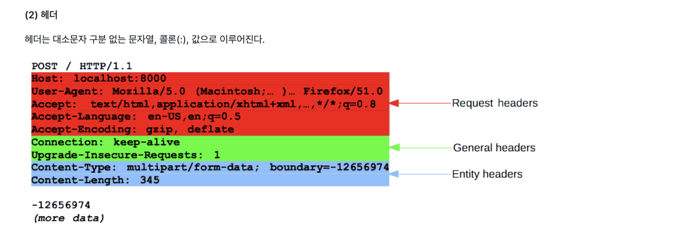
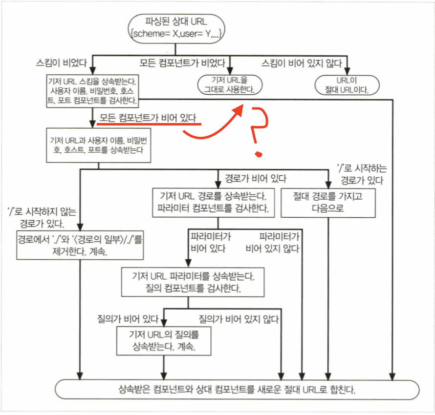

# 질문과 답변

## 2.1 인터넷의 리소스 탐색하기

### Q. "HTTP 애플리케이션은 URL을 URI의 한 부분으로 취급한다"가 무슨 뜻이야? 실제 HTTP 애플리케이션이 어떻게 \(URL을 포함한\) URI를 취급하는 것일까? \(우빈\)

> 책 28페이지에 있는 문장을 읽고 궁금한 점이 생긴 것인데, HTTP 어플리케이션이 URI를 처리할 때 URL과 URN을 구분하지 않고 처리한다는 것일까? 뒷부분을 아직 안 읽어봐서... 함께 이야기해보면 좋겠다.

### Q. 서버는 어떻게 URL로 프로토콜을 추론해서 리소스를 올바르게 가져오는 것일까? \(일식\)

### ‌ Q. semicolon parameter와 ampersand parameter는 무엇이 다르고, semicolon parameter는 어떻게 쓸 수 있는 것일까? \(일식\)

### ‌ Q. ftp 서버로 요청을 날렸을 때, 내가 네트워크를 확인할 수 있을까? 어떻게? \(일식\)

### ‌ Q. FTP 요청과 응답 관련된 헤더 정보에는 무엇이 포함되는가? \(일식\)

### ‌ Q. FTP는 바이너리, 텍스트를 지원한다. 각 데이터 형식마다 브라우저는, 혹은 서버는 어떻게 데이터를 핸들링할 수 있는가? \(일식\)

## 2.2 URL 문법

### Q. URL에 사용자 이름과 비밀번호를 넘기는 것은 보안 문제가 없을까? \(우빈\)

1\) 보안 문제가 있을 것이라고 추측할 수 있다. 브라우저에 인터넷 사용 기록이 남는다거나, 로그에 URL이 찍히기 때문이다.

2\) 하지만 이 URL이 그대로 사용되는 것은 아니다. 로그가 남아도 보통 host 주소까지만 남는다. 왜냐하면 브라우저가 `username:password` 조합을 받아서 Authorization 헤더로 변환하기 때문이다. \([https://stackoverflow.com/questions/1582894/how-to-send-password-securely-over-http](https://stackoverflow.com/questions/1582894/how-to-send-password-securely-over-http)\) 기본적으로는 Basic access authentication\([https://en.wikipedia.org/wiki/Basic\_access\_authentication](https://en.wikipedia.org/wiki/Basic_access_authentication)\)이 사용된다. 다른 헤더들과 마찬가지로 HTTPS에 의해 암호화된다.

### Q. 포트가 무엇인지 정리해보자 \(우빈\)

> 포트란 무엇인가라고 검색했더니 검색 결과에 웬 fortran이...

컴퓨터에는 USB와 같은 하드웨어 포트와 소프트웨어 포트, 두 가지 종류의 포트한다. 보통 포트는 소프트웨어 포트를 부르는 말로 사용된다. TCP나 UDP 에서 어플리케이션이 상호구분을 위해서 사용하는 번호이다. IP 내에서 프로세스 구분을 하기 위해서 사용한다.



* 0번 - 1023번: [잘 알려진 포트](https://ko.wikipedia.org/wiki/%EC%9E%98_%EC%95%8C%EB%A0%A4%EC%A7%84_%ED%8F%AC%ED%8A%B8) \(well-known port\)
  * 80: HTTP
  * 443: HTTPS
* 1024번 - 49151번: 등록된 포트 \(registered port\)
  * 3306: MySQL
* 49152번 - 65535번: 동적 포트 \(dynamic port\)
  * 어떤 프로세스든 임의로 사용 가능

### Q. URL 문법에서 파라미터와 질의가 어떻게 다른지 잘 모르겠어요

파라미터와 질의는 모두 key-value 형태로 URL 상에 추가적인 정보를 제공해주지만, 가장 큰 차이는 질의는 언제나 URL 의 일부여야 한다는 것입니다. 반면 파라미터는 form-data 형태로 URL 에 나타나지 않은 채로 전송될 수 있습니다.

[What is the difference between URL parameters and query strings? - Stack Overflow](https://stackoverflow.com/questions/39266970/what-is-the-difference-between-url-parameters-and-query-strings).

### Q. 프래그먼트 예시

github 의 linux 프로젝트 main.c 의 111 번째 프래그먼트를 요청해보았다 \([https://github.com/torvalds/linux/blob/43b815c6a8e7dbccb5b8bd9c4b099c24bc22d135/init/main.c\#L111](https://github.com/torvalds/linux/blob/43b815c6a8e7dbccb5b8bd9c4b099c24bc22d135/init/main.c#L111)\)


실제로 request url 에는 fragment\(\#\) 이 포함되어 있지 않지만 browser 에서는 111번째 라인부터 표시해준다

## 2.3 단축 URL

### Q. 상대 URL 예시

> [https://github.com/jeuxdeau/http-the-definitive-guide/blob/master/i.http-the-webs-foundation/01.overview-of-http/01.overview-of-http-answers.md](https://github.com/jeuxdeau/http-the-definitive-guide/blob/master/i.http-the-webs-foundation/01.overview-of-http/01.overview-of-http-answers.md)



```markup
<p><strong>(2) 헤더</strong></p>
<p>헤더는 대소문자 구분 없는 문자열, 콜론(:), 값으로 이루어진다.</p>
<p>
  <a
    target="_blank"
    rel="noopener noreferrer"
    href="/jeuxdeau/http-the-definitive-guide/blob/master/.gitbook/assets/http_request_headers2.png"
    ></a>
</p>
```

1. .png 의 경로가 /jeuxdeau/... 로 시작한다 \(상대 참조\)
2. tag 가 없다
3. 기저 URL 이 명시되지 않았으므로 해당 리소스의 URL 을 기저 URL 로 사용한다
4. URL 분해 알고리즘을 사용하여 기저 URL 을 파싱한다
   1. 스킴이 비었다 \([https://github.com/jeuxdeau/http-the-definitive-guide/blob/master/i.http-the-webs-foundation/01.overview-of-http/01.overview-of-http-answers.md](https://github.com/jeuxdeau/http-the-definitive-guide/blob/master/i.http-the-webs-foundation/01.overview-of-http/01.overview-of-http-answers.md) 에서 스킴을 상속받고 사용자 이름, 비밀번호, 호스트, 포트 컴포넌트를 검사\)
      * https://
   2. 적어도 한 개 이상의 컴포넌트가 존재한다 \(사용자 이름, 비밀번호, 호스트, 포트를 상속받는다\)
      * [https://github.com](https://github.com)
   3. '/'로 시작하는 경로가 있다
   4. 상속받은 컴포넌트와 상대 컴포넌트를 합친다
      * [https://github.com/jeuxdeau/http-the-definitive-guide/blob/master/.gitbook/assets/http\_request\_headers2.png](https://github.com/jeuxdeau/http-the-definitive-guide/blob/master/.gitbook/assets/http_request_headers2.png)

> 모든 컴포넌트가 비어 있다가 오른쪽 방향 아닌가?



1. 이미지의 source 는 [https://github.com/jeuxdeau/http-the-definitive-guide/blob/master/.gitbook/assets/http\_request\_headers2.png](https://github.com/jeuxdeau/http-the-definitive-guide/blob/master/.gitbook/assets/http_request_headers2.png) 가 된다

### Q. 브라우저는 base tag를 어떻게 활용할까? 내가 직접 브라우저가 이걸 활용하는걸 볼 수 있을까? \(일식\)

### ‌Q. 각 리소스마다 여러개의 base를 둘 수 있을까? \(일식\)

## 2.4 안전하지 않은 문자

### Q. 한글 URL? 도메인? 한자 도메인 이슈? \(우빈\)

`청와대.한국`, `초록꿈체험만을.kr` 처럼 한글로 이루어진 도메인들이 있다. 2장에 따르면. url에 사용될 수 있는 안전한 문자 집합은 ascii뿐이다. 한글 도메인이 사용 가능한 이유는 브라우저와 같은 클라이언트에서 한글을 유니코드로 변환해주기 때문이다. 이때 사용되는 알고리즘의 이름은 퓨니코드\(Punycode\)이다.

> [\(RFC 3492\) Punycode: A Bootstring encoding of Unicode for Internationalized Domain Names in Applications \(IDNA\)](https://tools.ietf.org/html/rfc3492)

**퓨니코드 변환 예시**

* 인플라자.kr =&gt; xn--oi2b361adc030e.kr
* 한글도메인.cc =&gt; xn--bj0bj3i97fq8o5lq.cc
* 삼성전자.com =&gt; xn--cg4bkiv2oina.com
* 소울메이트.net =&gt; xn--h32b15krresva952b.net

**한자 도메인 이슈**

> [한자 도메인, 안 돼!](https://no-hanja-domain.github.io/) [좀 더 기술적인 이야기들](https://no-hanja-domain.github.io/technical.html)

### Q. url은 같은데 스킴만 다르다면 다른 URL? \(일식\)

### ‌Q. escape를 안하고 URL을 서버로 전송하면, 서버는 어떻게 해당 URL을 받는가? \(일식\)

## 2.5 스킴의 바

### **Q. 웹과 URL이 출연하기 전 ftp를 어떻게 이용했을까?**

[파일 전송 프로토콜 \(위키백과\)](https://ko.wikipedia.org/wiki/%ED%8C%8C%EC%9D%BC_%EC%A0%84%EC%86%A1_%ED%94%84%EB%A1%9C%ED%86%A0%EC%BD%9C)

* FTP는 파일 전송 프로토콜\(File Transfer Protocol\)의 약자이다.
* 최초의 FTP 클라이언트 애플리케이션들은 OS가 GUI를 갖추기 이전에 개발된 CLI였다.
* 대부분의 윈도우, 유닉스, 리눅스 계열 OS에도 현재도 기본 포함되어 있다.

> 1990년대에는 대부분의 소프트웨어 업체나 게임 업체 등이 별도의 FTP 서버를 구축하고 익명의 접속을 허용한 후에 자신들이 개발한 프로그램의 셰어웨어나 데모 버전, 패치 등을 공개하곤 하였다. 사실 그 시절에는 지금처럼 인터넷이 발달한 것이 아니었기에 FTP 말고는 불특정 다수에게 효과적으로 자료를 배포할 수 있는 방법이 거의 없었다. 외국의 다른 게임 회사들 대부분은 비슷한 방식으로 FTP 서버를 운용하는 곳이 있고 간혹 예전에 발매했던 추억의 게임들을 FTP에서 무료로 받을 수 있는 경우도 있는 경우도 있으니 찾아보는 것도 나쁘지는 않다. 다만 현재는 자사 웹사이트에 공개하는 게 여러 모로 이득이고, 패치 같은 것은 프로그램 내에 패치 업데이트용 프로그램을 내장시키는 추세라서 FTP에 대해 배우는 곳도 많지 않고, 사장되는 추세이다. \(출처: [FTP \(꺼라위키\)](https://namu.wiki/w/FTP)

### Q. TLS 버전은 왜 있고, 무슨 차이가 있을까? \(일식\)

### ‌Q. TLS 암호화는 어떤 식으로 이루어질까? \(일식\)

## 2.6 미래

### Q. 현재 URN 표준화 작업은 어떻게 진행되고 있을까? \(우빈\) <a id="urn"></a>

> [https://committee.tta.or.kr/data/weekly\_view.jsp?news\_id=3384](https://committee.tta.or.kr/data/weekly_view.jsp?news_id=3384)

[    
](https://jeuxdeau.gitbook.io/http-the-definitive-guide/i.http-the-webs-foundation/02.urls-and-resources)

