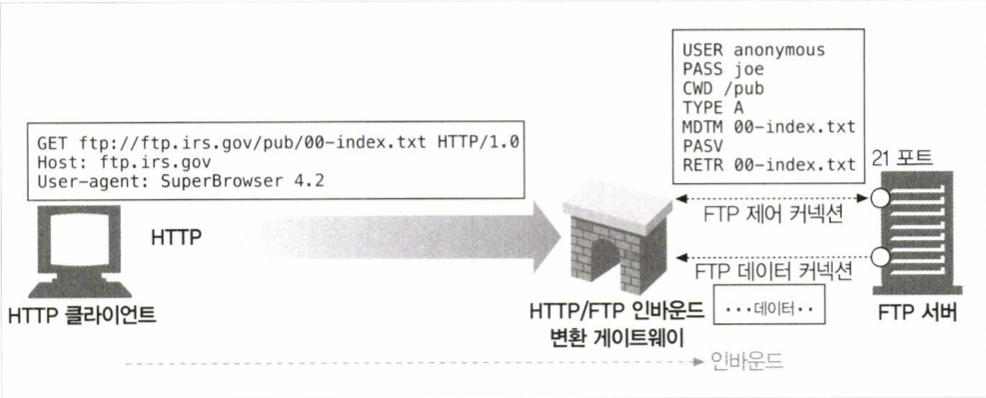
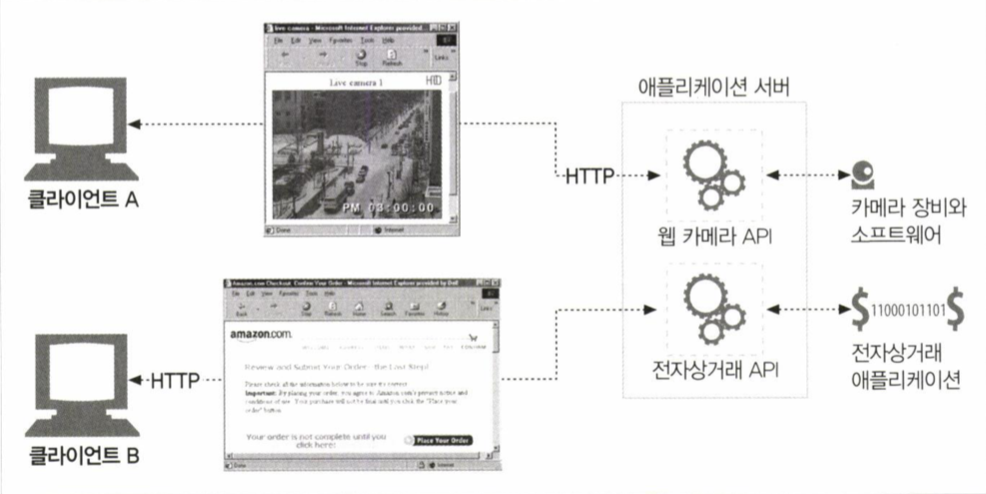
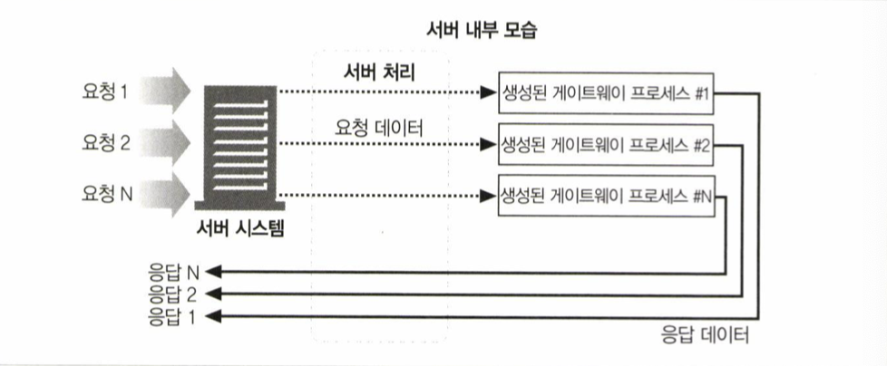
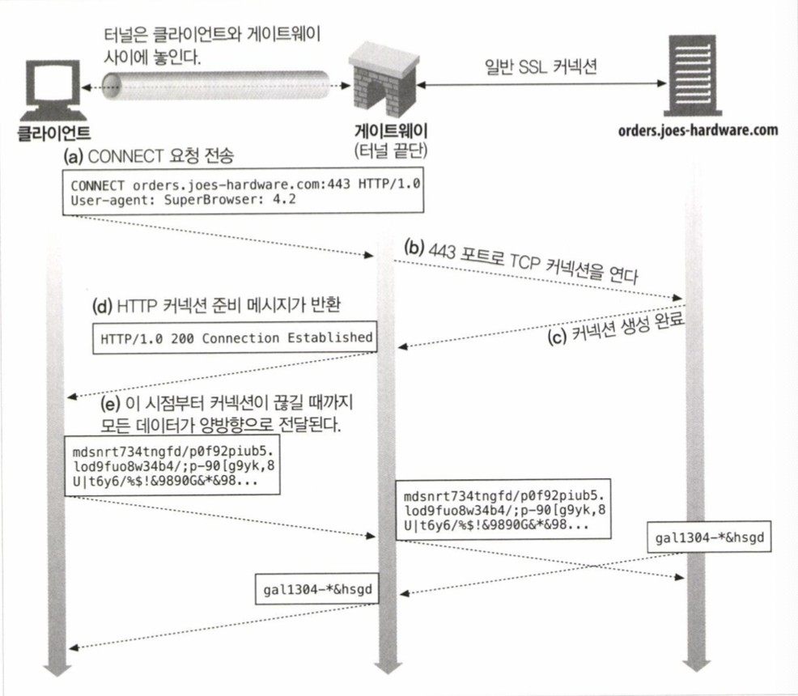
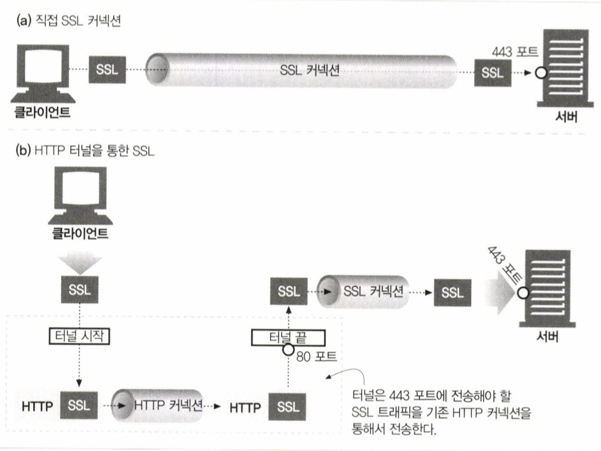

# 08. 통합점: 게이트웨이, 터널, 릴레이

## 개요
* HTTP 는 웹에 있는 모든 리소스에 대한 프로토콜로써 사용된다
* 여러 종류의 리소스에 접근하는데 HTTP 가 어떻게 사용되는지, 다른 프로토콜이나 어플리케이션 간 통신에 HTTP 가 어떻게 쓰이는지 알아보자
	* 게이트웨이
		* 서로 다른 프로토콜과 어플리케이션 간의 HTTP 인터페이스
	* 어플리케이션 인터페이스
		* 서로 다른 형식의 웹 어플리케이션이 통신하는데 사용
	* 터널
		* HTTP 커넥션을 사용해 HTTP 가 아닌 트래픽을 전송하는 데 사용한다
	* 릴레이
		* HTTP 프락시로, 한 번에 한 개의 홉에 데이터를 전달하는데 사용한다

## 게이트웨이
* 게이트웨이는 한 개의 어플리케이션만으로 모든 리소스를 처리하기 힘들어지면서, 리소스를 받기 위한 경로를 안내하기 위한 목적으로 고안됨
* 리소스와 어플리케이션을 연결하는 역할
	* HTTP 요청을 다른 프로토콜로 변환
	* HTTPS 요청을 HTTP 요청으로 변환
	* HTTP 클라이언트와 서버 어플리케이션 연결

### 클라이언트 측 게이트웨이와 서버 측 게이트웨이
* 웹 게이트웨이는 클라이언트 측 프로토콜과 서버 측 프로토콜을 (/) 으로 구별하여 기술
	* <클라이언트 프로토콜>/<서버 프로토콜> 게이트웨이

### 프로토콜 게이트웨이
* 클라이언트는 명시적으로 게이트웨이를 통해 HTTP 트래픽을 보낼 수 있음
> Example
* 브라우저를 사용해 서버 측 FTP 게이트웨이를 사용하도록 설정
	* 브라우저는 게이트웨이로 HTTP 요청을 보내고, 게이트웨이가 이를 FTP 로 변환해 FTP 서버로 요청을 보낸다

#### HTTP/*: 서버 측 웹 게이트웨이
* 클라이언트로부터 받은 HTTP 요청을 다른 프로토콜로 전환
> Example
* 게이트웨이가 클라이언트의 HTTP 요청을 FTP 로 변환하여 처리하는 과정
	1. 클라이언트로부터 HTTP 요청을 받음
	2. USER 와 PASS 명령을 보내 서버에 로그인
	3. 서버에서 적절한 디렉터리로 변경하기 위해 CWD 명령을 내림
	4. 다운로드 형식을 ASCII 로 설정
	5. MDTM 으로 문서의 최근 수정 시간을 가져옴
	6. PASV 로 서버에게 수동형 데이터 검색을 하겠다고 말함
	7. RETR 로 객체 검색
	8. FTP 서버에 데이터 커넥션을 맺고 객체가 게이트웨이로 전송됨
	9. 전송된 객체를 HTTP 응답에 실어 클라이언트로 전송

#### HTTP/HTTPS: 서버 측 보안 게이트웨이
* 클라이언트의 HTTP 요청을 HTTPS 로 암호화
* 클라이언트는 HTTP 로 통신하지만 게이트웨이가 자동으로 모든 세션을 암호화

#### HTTPS/HTTP: 클라이언트 측 보안 가속 게이트웨이
* 클라이언트의 HTTPS 요청을 받아 복호화하여 서버로 HTTP 요청을 전달
* 보안 트래픽 복호화에 최적화된 하드웨어를 사용하여 효율적으로 사용 가능
* 게이트웨이와 원 서버 사이 트래픽은 암호화되지 않기 때문에 주의 필요

### 리소스 게이트웨이
* 게이트웨이의 가장 일반적인 형태는 어플리케이션 서버이다
	* 목적지 서버와 게이트웨이를 한 개의 서버로 결합
* 클라이언트는 어플리케이션 서버와 통신하고, 어플리케이션 서버는 게이트웨이를 통해 어플리케이션 프로그램과 통신한다
> Example
* 클라이언트는 HTTP 를 사용해 어플리케이션 서버로 요청을 하고, 어플리케이션 서버는 게이트웨이를 사용해 요청의 최종 목적지인 어플리케이션과 통신하여 응답을 클라이언트로 반환
* 클라이언트 <-> 어플리케이션 서버 <-> 어플리케이션 프로그램 

* 어플리케이션 서버 <-> 게이트웨이 <-> 어플리케이션 프로그램

#### 공용 게이트웨이 인터페이스
* 최초의 서버 확장
	* 동적인 HTML, 데이터베이스 질의와 같은 기능들을 제공
* CGI 내부 동작을 사용자로부터 숨김
	* 다양한 확장으로부터 서버를 보호
* 요청 당 프로세스 생성에 대한 부하로 성능 저하
	* 데몬 프로세스로 동작하는 Fast CGI 등장

#### 서버 확장 API
* 서버의 컴포넌트를 웹 개발자의 코드로 교체하거나 연결할 수 있게 해주는 API
	* 서버 자체의 동작을 바꾸거나 서버의 처리능력을 최대한 활용하기 위해
	* 서버 어플리케이션과 함께 메모리에 로드되어 있어 CGI 보다 유리

### 어플리케이션 인터페이스와 웹 서비스
* HTTP 는 어플리케이션들을 연결하는 도구로 사용될 수 있음
	* 상호 간 프로토콜 인터페이스를 맞추는 것이 필요
		* RPC 메서드와 관련 변수들을 HTTP POST 요청을 사용해 교환
		* HTTP 헤더에 XML 추가 (SOAP)
		* ...

### 터널
* HTTP 를 지원하ㅇ 않는 어플리케이션에 HTTP 어플리케이션을 사용해 접근하는 방법을 제공
	* HTTP 커넥션을 사용해 HTTP 가 아닌 트래픽을 전송 가능
	* 다른 프로토콜 트래픽을 HTTP 를 사용해 통신 가능

#### CONNECT 로 HTTP 터널 커넥션 맺기
* 웹 터널은 CONNECT 메서드를 사용해 커넥션을 맺을 수 있음
	* 터널 게이트웨이가 목적 서버와 TCP 커넥션을 맺고, 클라이언트와 서버 간 오가는 데이터를 무조건 전달하기를 요청
> Example

1. CONNECT 요청을 보내 게이트웨이에 터널 연결 요청
2. TCP 커넥션 생성 후 클라이언트로 200 응답 반환
3. 클라이언트가 HTTP 요청을 보내면 터널을 통해 TCP 커넥션으로 서버에 전달
4. 서버가 TCP 커넥션을 통해 데이터를 보내면 터널을 통해 HTTP 로 클라이언트에 전달

* CONNECT 요청
CONNECT 요청 메세지의 URI 는 호스트명과 포트를 기술한다
> CONNECT home.netscape.com:443 HTTP/1.0

> User-agent: Mozilla/4.0

* CONNECT 응답
CONNECT 응답 메세지는 커넥션이 메세지 대신 바이트를 그대로 전달하기 때문에 Content-Type 헤더가 필요 없다
> HTTP/1.0 Connection Established

> Proxy-agent: Netscape-Proxy/1.1

#### 데이터 터널링, 시간, 커넥션 관리
* 게이트웨이는 터널을 통해 전달되는 데이터를 볼 수 없다
* 게이트웨이는 커넥션이 맺어지는 대로 헤더를 포함해 읽어들이는 모든 데이터를 서버에 전송해야 함
	* 프로토콜이 데이터 의존성을 포함할 수 있기 때문에 한 쪽에서 데이터를 소비하지 않으면 반대쪽 생산자가 행에 걸리고 교착상태가 발생할 수 있다
* 터널링을 사용하다 커넥션이 끊어지는 경우 한 쪽의 전송하지 않은 데이터는 버려진다
* 요청 데이터 크기를 주의하며 파이프라인 통신을 해야 한다
	* TCP 리셋으로 인해 클라이언트가 응답을 확인할 수 없어 통신 실패의 원인을 알 수 없게 만들 수 있다 

#### SSL 터널링
* SSL 트래픽이 HTTP 만을 허용하는 방화벽을 통과하기 위한 방법
	* 중간에 SSL 을 지원하지 않는 프록시가 포함되어 있는 등의 이유로 SSL 통신이 불가능 할 때
	* SSL 트래픽을 HTTP 커넥션으로 전송하여 방화벽을 통과
> Example

* SSL 트래픽은 처음에 HTTP 를 통해 전송되고 이후 SSL 커넥션에 의해 전송된다

#### SSL 터널링 vs HTTP/HTTPS 게이트웨이
* HTTP/HTTPS 게이트웨이
	* 클라이언트 - 게이트웨이 사이는 HTTP 로 통신하여 보안에 취약
	* 클라이언트는 원격 서버에 SSL 클라이언트 인증이 불가
	* 게이트웨이가 SSL 을 지원해야 함
* SSL 터널링
	* 게이트웨이는 SSL 을 구현할 필요가 없음
	* SSL 세션은 클랑이언트와 목적지 웹 서버간에 생성

#### 터널 인증
* 게이트웨이는 인증을 통과한 클라이언트에게만 터널링을 제공할 수 있음

##### 터널 보안에 대한 고려사항들
* 터널 게이트웨이는 데이터를 확인할 수 없기 때문에 특정 포트만을 터널링 할 수 있게 하는 등의 정책과 함께 사용하는 것을 권장

### 릴레이
* HTTP 명세를 준수하지 않는 프록시
	* HTTP 통신을 하지만 단순히 데이터 전달만을 고려한 프록시
	* 간단하게 구현이 가능
	* 단순한 데이터 필터링이나 콘텐츠 변환에 사용되기도 함
* 멍청한 프록시 문제와 같은 HTTP 명세를 준수하지 않아 발생할 수 있는 문제점들을 내포하고 있음
