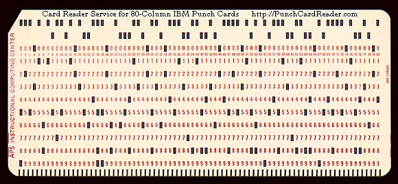

# Answers

### Q. \(10.1\) 회전 지연이란 무엇인가.

* rotational latency. 왕복하는데 걸리는 시간.

### Q. \(10.2\) 서버 푸시는 어떤 식으로 가능할까?

* server push는 서버가 클라이언트 요청의 리소스 요구에 대해 예측할 수 있게 한다.
* 그에 따라 서버는 클라이언트의 요청이  완료되기 전에 필요한 리소스들을 보낼 수 있게 된다.
* 클라는 web page를 달라는 요청을 보낸다.
* 서버는 이 요청을 처리하는 도중에 페이지에 dependencies가 걸려있는 리소스들을 분석해서 이것들까지 같이 클라의 캐시로 보내버린다.
* 클라가 응답을 받았을 때, 이미 원하는 모든 리소스가 캐시에 있게 된다.
* 서버는 `PUSH_PROMISE` 프레임을 클라에게 보내는데, 클라는 이것을 거부할 수 있다.\(이미 캐시에 리소스가 존재하는 경우 등\) `RST_STREAM` 프레임으로 응답하여 거부한다.
* 모든 `PUSH_PROMISE` 프레임은 response data 이전에 보내지므로, 클라는 어떤 리소스를 요청해야 할지를 알게 된다.

### Q. \(10.3.1\) 각 프레임의 종류는 무엇이 있으며 어떤 의미인가?

* 통신의 기본 단위는 프레임이다.
* 각 프레임은 길이와 타입을 포함하는 헤더를 가진다.
* length - 프레임의 사이즈를 기록. 최대 2^24 bytes까지 기록 가능. 디폴트는 2^14까지.
* type
  * `HEADERS` - 이 프레임은 HTTP header info만을 가진다.
  * `DATA` - 메시지의 부분 혹은 전부의 데이터를 가진다.
  * `PRIORITY` - 스트림에 전달할 우선순위.
  * `RST_STREAM` - 에러를 알림. push promise의 거부, 스트림 종료 등.
  * `SETTINGS` - connection configuration을 정의.
  * `PUSH_PROMISE` - 클라이언트에게 리소스를 push할 것임을 알림.
  * `PING` - headerbeat and rount-trip time
  * `GOAWAY` - 현재 커넥션에 대해 더이상 스트림을 생성하지 말라는 것을 알린다.
  * `WINDOW_UPDATE` - stream의 flow control에 쓰임.
  * `CONTINUATION` - header fragments의 연속.
* flags
  * `DATA` frame은 두개 헤더를 정의. `END_STREAM`은 data stream의 끝을 알리는 것. `PADDED`는 패딩이 있다는 것을 알림.
  * `HEADERS` frames는 `DATA` frame의 플래그에 더해 `END_HEADERS` \(헤더 프레임의 끝을 알림\),`PRIORITY` \(stream priority가 세트되었음을 알림\)를 정의.
  * `PUSH_PROMISE` 프레임은 `END_HEADERS`, `PADDED` 플래그를 정의.

### Q. \(10.3.1\) 스트림 식별자는 어떤 식으로 작동할까? 왜 필요할까?

* 스트림 식별자\(stream identifier\)는 logical stream에서 frames membership을 추적하는데 사용.
* membership은 하나의 메시지와 스트림에 해당된다.

### Q. \(10.3.2\) window update 흐름제어는 어떻게 이뤄지는 것일까?

* flow control은 data의 전송을 관리하므로, receiver가 sender에 의해 overwhelmed되지 않게 한다.
* receiver가, 전송되는 데이터의 양을 줄이거나 데이터 전송을 중단하게 할 수 있다.
* video streaming service에서, 비디오 재생이 멈춘다면 클라는 서버에게 비디오 데이터 전송을 중단하라고 알려 캐시 고갈을 막을 수 있다.
* 커넥션이 열릴 때 서버와 클라는 `SETTINGS` 프레임을 교환하여 flow-control window의 사이즈를 조정할 수 있다. 디폴트로 65kb지만, `WINDOW_UPDATE` 프레임을 교환하여 조정할 수 있다.

### Q. \(10.3.3\) HPACK 명세?

* HPACK을 활용한다.
* HPACK의 목표는, client request와 server response간의 중복된 헤더를 제거하는 것.
* header compression을 위해, 클라와 서버는 이전에 보았던 header fields의 리스트를 유지해야 한다.
* 이 리스트는 미래의 메시지를 만들때 seen-headers list로 사용된다.
* client 쪽에서 두개의 요청에서 헤더가 중복되었을 때도 사용된다.

### Q. ietf는 왜 이렇게 읽기 힘들게 사이트를 만들어 놨나? 디자이너가 없나? ex. [https://tools.ietf.org/html/rfc7540](https://tools.ietf.org/html/rfc7540)

일식: vim 같은 데서 볼 때 [Eighty Column Rule](https://www.emacswiki.org/emacs/EightyColumnRule)을 따랐기 때문이다.

> ref1: [Why is 80 characters the 'standard' limit for code width?](https://softwareengineering.stackexchange.com/questions/148677/why-is-80-characters-the-standard-limit-for-code-width)

> ref2: Eighty Column Rule을 현대에 유지해야 할 필요가 있을까? [Is the 80 character limit still relevant in times of widescreen monitors?](https://softwareengineering.stackexchange.com/questions/604/is-the-80-character-limit-still-relevant-in-times-of-widescreen-monitors)

### 

### 

