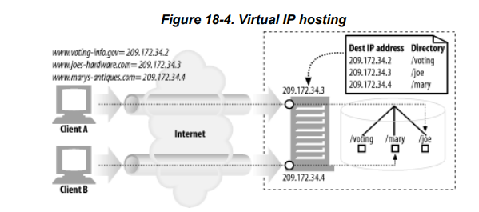
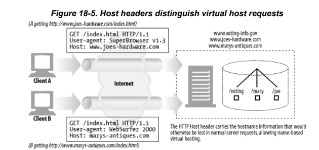
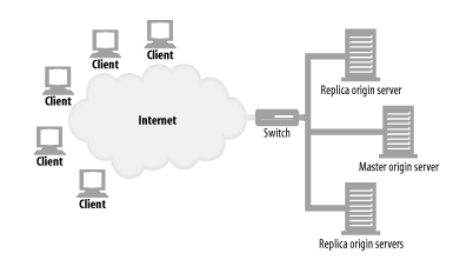

# 18. 웹 호스팅

이 장에서는 다음의 내용을 포함한다.

* 웹 호스팅이 뭔지 \(간략하게\)
* 웹 호스팅 중 가상 호스팅 기법, 그리고 이 기법의 문제점 \(자세히\)
* 그 외 이슈 조금

## 웹 호스팅이란?

웹 사이트를 통해 공유할 수 있는 모든 컨텐츠 리소스의 저장, 중개, 관리를 망라하는 일

* 저장 : \(텍스트, 이미지, 동영상, 그 외 웹 어플리케이션 등 컨텐츠로 표현하기 위해 필요한 재료\) 리소스를 저장매체에 보관한다. 미러링\(복제되어 다른 위치에 보관\)될 수 있다.
* 중개 : 클라이언트가 원하는 컨텐츠를 표현하기 위해 리소스를 반환한다. 리소스는 캐싱\(원 서버를 거치기 전에 반환\)될 수 도 있다.
* 관리 : 저장, 중개를 위해 항상 켜져있는 서버가 필요하다. 이 서버의 관리를 말한다. \(로그에 접근하거나, 설정 값을 변경하거나, 등...\)

### 호스팅 업체

웹 호스팅을 대신 해주는 업체.

#### 장점

경제적, 일반적으로 믿을 수 있음, 좋은 성능을 쉽게 얻을 수 있음.

#### 단점

저장, 중개, 관리에 제약이 따름. 모든 것을 관리하는 데 필요한 자원\(기술, 돈, 시간\)을 줄일 수 있다.

### 웹 호스팅의 예시

#### 전용 호스팅 \(1:1\)

#### 가상 호스팅 \(多:1\)

가상 호스팅은 컴퓨팅 파워를 효율적으로 사용하기 위해 여러 고객의 컨텐츠를 하나의 장비가 호스팅한다.

## 가상 호스팅 문제 : 호스트 식별 문제

> 현대에는 거의 대부분의 브라우저가 HTTP/1.1 이상을 사용함으로써 모두 해소되었다. \(클라이언트 구현시 HTTP/1.1 스펙 중 호스트 관련 스펙만 따라준다면 문제가 해소된다.\)

HTTP/1.0 요청은 호스트명을 제외시킨다.

DNS를 통해 IP를 받아 커넥션을 맺은 후 동일한 호스트명을 사용한다는 가정하에 API 요청을 하기 때문.

그러나 가상 호스팅은 커넥션을 맺은 장비가 여러 웹 서비스를 호스팅할 수 있다.

이 문제는 대리 서버 \(리버스 프록시\), 인터셉터 프록시에도 똑같은 영향을 준다.

### 해결 방법

#### 1. URL 경로를 통한 가상 호스팅 \(잘 안 쓰임\)

URL 경로에 가상 호스팅임을 명시적으로 표현하는 것.

**예시**

a라는 서비스와 b라는 서비스가 같은 공용 서버를 사용한다고 생각한다면 다음과 같이 URL 을 구성한다.

[https://a-web.com/a-web/index.html](https://a-web.com/a-web/index.html)

[https://b-web.com/b-web/index.html](https://b-web.com/b-web/index.html)

만약 위 두 URL 에 대해 GET 요청을 하게 된다면 다음과 같은 요청이 만들어진다.

GET /a-web/index.html

GET /b-web/index.html

이로써 가장 상위에 정의된 URL을 가상호스팅 정보로 사용하면 공용 서버는 클라이언트가 원하는 컨텐츠를 제공할 수 있다.

**문제점**

* 불필요한 접두어 사용 강제
* [https://b-web.com/a-web/index.html](https://b-web.com/a-web/index.html) 은 a-web의 컨텐츠를 주어야 하는가?
* [https://b-web.com/index.html](https://b-web.com/index.html) 은 제대로된 컨텐츠를 반환할 수 없다.
* 호스트 명이 쓸모없는 정보가 되어 버림. \(혼란스러움\)

#### 2. 포트번호를 통한 가상 호스팅 \(잘 안 쓰임\)

a-web 에는 81 포트

b-web 에는 82 포트를 부여한다.

**문제점**

* 유저가 URL + 포트 번호 까지 기억해서 사용해야 함.
* 포트번호는 원래 지저분해서 잘 안 쓰임. 누구나 80포트를 쓰고 싶어함.

#### 3. IP 주소를 통한 가상 호스팅 \(대체로 쓰였었음\)

각 가상 웹 사이트에 IP를 한 개 이상 부여하고 모든 IP 들을 공용 서버에 연결 시킨다.

공용 서버는 요청 헤더에 명시된 목적지 IP 주소\(가상 IP\)를 읽어서 적절한 컨텐츠를 반환할 수 있다.

**문제점**

* 하나의 컴퓨터가 연결할 수 있는 IP 개수의 제한
* IP 주소 자체가 희소 상품이라 확보하는 데에 제약이 따름
  * 뿐만 아니라, 서버 복제가 필요하면 복제된 서버 개수만큼 IP는 더 필요해진다

#### 4. Host 헤더를 통한 가상 호스팅 \(지금은 거의 이걸 씀\)

HTTP/1.0+ 버전 이후부터 새로운 확장 헤더를 만들어 사용한다.

Host 헤더는 호스트가 무엇인지 식별할 수 있다.

## HTTP/1.1 의 Host 헤더 스펙

Host = "Host" ":" 호스트\[ ":"포트 \]

* 포트가 없으면 기본 스킴\(80, 443\)을 따름
* URL 에 명시된 호스트 또는 IP 를 그대로 포함해야 한다
  * URL 에는 호스트명 / Host 헤더에는 IP 를 포함하면 : 위에서 다룬 가상 호스팅 문제가 발생한다 \(하나의 IP가 여러 호스트를 다룰 수 있는데 이를 해결하지 못함\)
  * URL 에는 IP / Host 헤더에는 호스트명을 포함하면 : URL 에 IP를 기입하면 호스트명을 알 수 없으므로 발생할 수 가 없다.
  * URL 은 명시되어있지 않을 수 있다. \(커넥션 맺은 뒤 HTTP/1.0의 경우\)
* 프록시를 사용하는 경우 Host 헤더에 프록시 정보가 들어가면 안된다.
* 클라는 모든 요청에 Host 헤더를 추가해야 함
* 프록시는 모든 요청에 Host 헤더를 추가해야 함 \(확장 헤더는 없어지니까 다시 추가함으로써 헤더가 없어지지 않게 방지\)
* 서버는 Host 헤더가 없으면 400을 내린다

### Host 헤더의 누락

서버는

* 기본 웹페이지 또는 브라우저 업그레이드를 요구하는 페이지를 반환하거나
* 400을 내린다.

### 서버의 Host 헤더 해석

* 전체 URL이 명시되어 있다면 Host 헤더를 무시한다.
* 그렇지 않다면 Host 헤더에서 호스트명과 포트를 가져온다.
* 어떻게도 호스트 정보를 알 수 없다면 400 Error

## 안정적인 웹 사이트 만들기

장애의 케이스

* 서버 다운
* 트래픽 폭증 \(갑작스런 트래픽으로 처리해야할 일이 많아진 서버 컴퓨터가 느려지거나 멈춘다\)
* 네트워크 장애 및 손실

### 해결 방법

#### 미러링 서버 팜

* 스위치가 서버인 척 하면서 요청을 분산시킨다.
* 마스터 원 서버는 복제된 서버들에게 변경된 리소스를 보낸다.

#### 분산 미러링 서버

* 마스터 서버가 각 지역의 복제된 서버에 리소스를 보내면서
* 리디렉션 시키거나\(HTTP 리디렉션\) 리디렉션 되도록 구성\(DNS 리디렉션\)한다.

**HTTP 리디렉션**

마스터가 요청을 받는 즉시 리디렉션

**DNS 리디렉션**

컨텐츠의 URL 이 4개의 IP 주소를 가리킬 수 있고 DNS 가 요청을 분산시킴

### 컨텐츠 분산 네트워크 \(CDN\)

특정 컨텐츠를 분산할 목적으로 구성하는 네트워크

#### 리버스 프록시 \(대리 캐시\) 구성

* 위에서 다룬 미러링 서버 팜이나 분산 미러링 서버에서의 원 서버에 가기 전에 리버스 프록시를 거치도록 구성한다.
* 리버스 프록시는 전체 리소스를 복제하는 복제 서버와는 다르게 클라이언트 요청에 따라 선택적으로 복제\(캐싱\)된 컨텐츠를 반환해준다.
* 사용자가 요청하기 전에 미리 가져오는 프록시 서버도 있다.
* 원 서버는 이 프록시에 리소스를 동기화할 의무는 없다

#### 프록시 캐시 구성

* 스위치가 클라이언트 요청을 가로채 프락시로 보내기도 한다.

